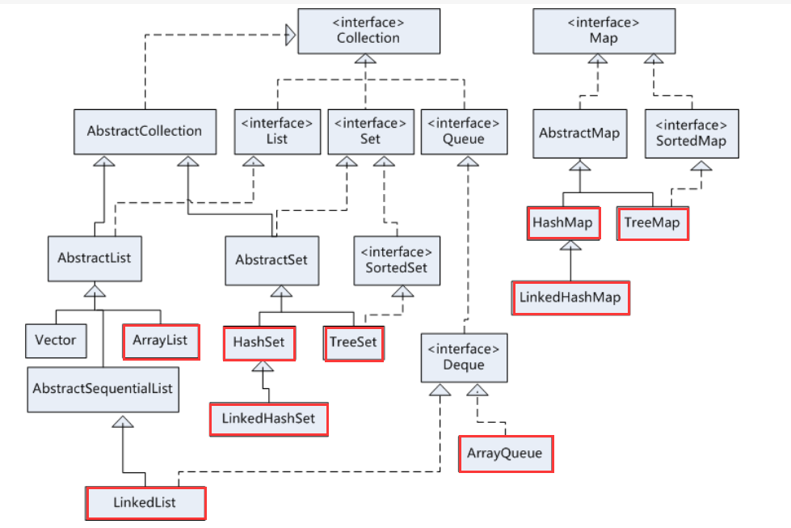
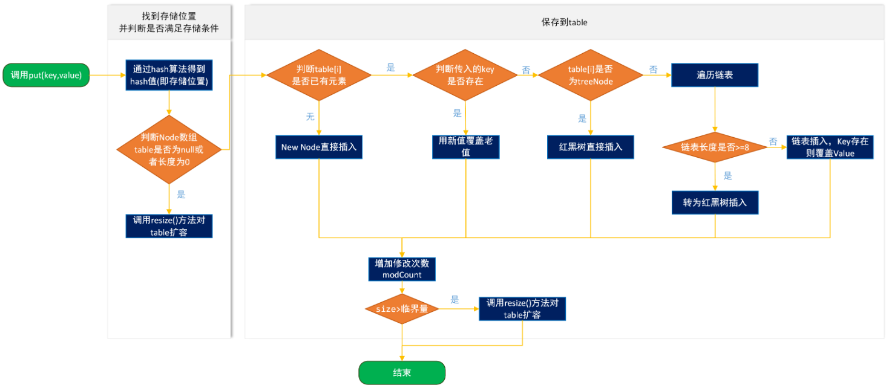

#集合的体系：
集合分为单列集合和多列集合，集合中只能存储引用数据类型数据，当存储基本数据类型时会自动装箱，集合体系如图所示：

##单列集合介绍：
* Collection是单列集合的根接口该接口继承Iterable接口，因此单列集合可迭代遍历；
* List、Set、Queue是Collection接口的子接口；
###List集合
* list集合元素有序、可重复；
* 该接口下有两个常用的实现类ArrayList和LinkedList，这两个实现类都是继承自AbstractList抽象类，且都是线程不安全集合；
    * ArrayList底层基于数组实现，有下标查询较快，由于执行增删改需要复制原有的数据到新数组中因此不适用于CUD操作，当集合多数用于查询时可创建ArrayList实例；
    * LinkedList底层基于链表实现，由于双向链表的数据结构可记录上一个元素和下一个元素的地址因此增删改较快；
###Set集合
* Set集合无序、不可重复；
* 该接口下有HashSet和TreeSet两个常用实现类，继承自AbstractSet抽象类；
    * HashSet根据hashCode值和equals方法来存储元素，向集合中存储元素时，先调用该元素的hashCode方法计算hashCode值判断存储位置，值不同，直接存储元素，相同调用equals方法判断该位置是否有该元素存在，返回false存储元素，返回true舍弃该元素。
    底层基于HashMap实现，add方法添加元素的时候实际是向map中添加了一个key为元素，value为PRESENT的Entry对象；
        * LinkedHashSet是HashSet的子类，但使用链表保证了元素存入顺序和取出顺序相同；
    * TreeSet实现了Sorted接口底层类似二叉树，往Set集合存储元素时会将元素转换为Comparable类型，往集合里存储元素时会调用compareTo方法进行比较，根据方法的返回结果进行存储（也可以自定义比较器进行存储）；
    
###Queue集合
* Queue集合基于队列数据结构实现；
* Queue还有一个Deque接口，代表一个双端队列，可以同时两头添加删除元素，因此既可以当成队列使用，又可以当成栈使用。实现类为ArrayDeque和LinkedList；
ArrayDeque是双端队列，所以对First，Last元素都有add get peek pool remove方法。
    * PriorityQueue继承了AbstractQueue抽象类实现了Queue接口，该实现类保存元素的顺序并不是按加入顺序，而是按元素的大小，PriorityQueue不允许存储nul值；
    * LinkedList实现类实现了Queue接口，代表一个双向队列，可以使用该类创建实例对象；
* 方法详解：
    * add()将指定元素加入队列尾部；
    * offer()加入尾部，但当容量有限队列时，方法比add好
    * peek() 获取头部元素不删除
    * element() 获取头部元素不删除
    * pool() 获取头部元素并删除
    * remove() 获取头部元素并删除
    ```java
        public class Test {
            public static void main(String[] args) {
                PriorityQueue<Character> queue1 = new PriorityQueue<>();
                queue1.offer('k');
                queue1.offer('f');
                queue1.offer('d');
                //打印结果为[d, k, f]
                System.out.println(queue1);
                //打印结果为d 获取头部元素不删除
                System.out.println(queue1.peek());
                //打印结果为d，获取头部元素删除
                System.out.println(queue1.poll());
                //打印结果为f
                System.out.println(queue1.peek());
        
                PriorityQueue<Object> queue2 = new PriorityQueue<>();
               /* //获取空列表不删除数据   出现NoSuchElementException运行时异常
                Object element = queue2.element();
                System.out.println(element);*/
                //不会出现异常打印出null值
                Object peek = queue2.peek();
                System.out.println(peek);
            }
        }
    ```
##多列集合介绍
* Map是多列集合的根接口，该接口下的实现类存储的数据都是以键值对的形式进行存储，存储的数据当键相同时原来的值会被覆盖掉；
* Map接口下有两个常用的实现类HashMap和TreeMap;都是继承了AbstractMap抽象类；
###HashMap
* HashMap存储数据是基于键的hashCode值存储元素，HashMap最多允许一条记录的键为null，允许多条记录的值为null
  * HashMap在jdk8之前向存储元素采用的是数组加链表的结构进行存储，往map中put一个元素时，会先根据key计算hashCode值判断存储位置，如果该位置没有元素将直接存入，如果有元素即出现hash冲突，
  由于数组中每个元素是单向链表，则将该元素存放在该元素的链表中。jdk8中HashMap采用了数组加链表加红黑树的结构，当链表节点大于等于8时链表转化为红黑树，链表节点小于6会从红黑树转化为链表
  
* HashMap取值get(Object key)流程，传入的key通过hash()算法得到hash值，在通过(n - 1) & hash找到数组下标，如果数组下标所对应的node值正好key一样就返回，否则找到node.next找到下一个节点，看是否是treenNode，
如果是，遍历红黑树找到对应node，如果不是遍历链表找到node。
####HashMap的扩容机制
* HashMap默认的数组大小是16，当HashMap中的元素超过数组元素*加载因子(0.75)，即12时，数组的大小就会扩容1倍
###TreeMap
* TreeMap原理同TreeSet;
    
#异常介绍
* Throwable是异常的顶级父接口，Error和Exception是子接口，Error错误一般是由jvm从底层抛出的问题，Exception异常一般是由于代码错误引起
##Exception分类
* Exception异常分为受查异常（会导致编译失败）和非受查异常，两者的主要区别如下：
    * RuntimeException类型异常程序在编译时不会出现编译通不过例如NullPointerException、ArithmaticException、ArrayIndexoutofBoundsException、ClassNotFountException等
    而Exception的其它子类型异常在方法调用的时候必须抛出或者进行捕获
* 异常应该在下层抛出，上层调用时try-catch进行捕获
##Throw和Throws的区别
* throw作用与方法内用于抛出具体异常对象，throws作用在方法上用于声明异常
* throw只能抛出一种异常，throws可以声明多种异常
* throw代表程序明确会出现指定的错误，throws代表的是可能
##JDK7关于异常的新特性
* 语句确保在语句的最后每个资源都被关闭，任何实现了java.lang.AutoCloseable和java.io.Closeable的对象都可以使用try-with-resource来实现异常处理和关闭资源。
由于一个外部资源的句柄对象（比如FileInputStream对象）实现了AutoCloseable接口，因此关流操作可以简化为如下所示
```java
public class ExceptionTest{
     @Test
        public void aa() {
           FileInputStream inputStream = null;
               try {
                   inputStream = new FileInputStream(new File("e://project"));
                   System.out.println(inputStream.read());
               } catch (IOException e) {
                   throw new RuntimeException(e.getMessage(), e);
               } finally {
                   if (inputStream != null) {
                       try {
                           inputStream.close();
                       } catch (IOException e) {
                           throw new RuntimeException(e.getMessage(), e);
                       }
                   }
               }
        }
    @Test
    public void aa() {
        try (FileInputStream inputStream = new FileInputStream(new File("e://project"))) {
            System.out.println(inputStream.read());
        } catch (IOException e) {
            throw new RuntimeException(e.getMessage(), e);
        }
    }
}

```
###try-with-resources优点
更完全。在出现资源泄漏的程序中，很多情况是开发人员没有或者开发人员没有正确的关闭资源所导致的。
JDK1.7之后采用try-with-resources的方式，则可以将资源关闭这种与业务实现没有很大直接关系的工作交给JVM完成。省去了部分开发中可能出现的代码风险。

#Maven介绍
##Maven的作用
* 作为跨平台的项目管理工具，maven针对web项目提供了统一目录结构，解决了以前由编译工具带来的目录结构不同的问题
* 提供了统一的仓库管理jar包，当项目中需要使用到某个jar包时只需要导入三围即可(包名、项目名、版本号)，jar包的冲突问题的解决可以使用以下方式解决
    * 声明优先(前提条件：如果maven能够识别出两个相同的依赖)
    * 就近原则(前提条件：如果maven能够识别出两个相同的依赖)
    * 排除法
    ```xml
      <dependency>
               <groupId>org.apache.struts</groupId>
               <artifactId>struts2-core</artifactId>
               <version>2.5.20</version>
               <exclusions>
                   <exclusion>
                       <groupId>org.javassist</groupId>
                       <artifactId>javassist</artifactId>
                   </exclusion>
               </exclusions>
      </dependency>
    ```   
    * 版本声明(手写导入依赖,可以不编写<version>,如果编写了<version>,还是根据编写的版本导入依赖)
    ```xml
         <!-->dependencyManagement用于依赖的声明<!-->
    	<dependencyManagement>
               <dependencies>
                   <dependency>
                       <groupId>org.javassist</groupId>
                       <artifactId>javassist</artifactId>
                       <version>3.24.0-GA</version>
                   </dependency>
               </dependencies>
        </dependencyManagement>
               
    ```
* 从项目的编译、测试、打包、部署，maven具有项目构建自动化
##Maven中依赖的作用域
* compile:在项目的编译、测试、运行过程中都包含在内
* provide:在项目的编译、测试过程包含(servlet依赖)
* runtime:在项目的运行、测试过程包含(jdbc依赖)
* test:只在项目测试过程包含(例如：junit依赖)
##Maven的配置
* 修改Maven默认的本地仓库地址<localRepository>本地仓库的绝对路径</localRepository>
* 配置阿里云私服，指定阿里云仓库的地址(也可指定公司内部私服地址)
* Maven的java项目，默认的编译版本是1.5，需要指定profile修改编译版本
##Maven的项目类型
* jar项目(普通的java项目)
* war项目(web项目)
* pom项目(作为父工程/聚合项目)
    * Maven搭建父子工程
```xml
    <!-->父工程项目<!-->
		<groupId>com.qf</groupId>
        <artifactId>father</artifactId>
        <version>1.0-SNAPSHOT</version>
        <modules>
            <module>../son</module>
        </modules>
        <packaging>pom</packaging>
        
    <!-->子工程引入父<!-->
		<parent>
            <artifactId>father</artifactId>
            <groupId>com.qf</groupId>
            <version>1.0-SNAPSHOT</version>
            <relativePath>../father/pom.xml</relativePath>
        </parent>
        <modelVersion>4.0.0</modelVersion>
        <artifactId>son</artifactId>
```
##Maven中其它标签介绍
###Properties标签
* properties标签用于定义系统变量，可以在pom文件中使用${属性名}方式引用
###build标签
Maven中build标签用于项目中的配置，build标签分为两种：一种是project build(全局配置)，一种是profile build
####build中常见插件
* maven整合tomcat7的插件(可指定端口号和项目路径)
```xml
    <build>
        <plugins>
            <plugin>
                <groupId>org.apache.tomcat.maven</groupId>
                <artifactId>tomcat7-maven-plugin</artifactId>
                <version>2.2</version>
                <configuration>
                    <!-- http://localhost -->
                    <port>80</port>
                    <path>/</path>
                    <uriEncoding>UTF-8</uriEncoding>
                </configuration>
            </plugin>
        </plugins>
    </build>
```
* 编译插件(可指定jdk编译的版本)
```xml
   <build>  
         <plugins>  
           <plugin>  
               <groupId>org.apache.maven.plugins</groupId>  
               <artifactId>maven-compiler-plugin</artifactId>  
               <version>2.3.2</version>  
               <configuration>  
                   <source>1.8</source>  
                   <target>1.8</target>  
               </configuration>  
           </plugin>  
         </plugins>  
   </build>  
```
##Maven的生命周期：
* mvn clean:清理编译的项目
* mvn compile:编译项目
* mvn test:运行测试类
* mvn package:将项目打包
* mvn install：安装项目到本地仓库
* mvn deploy:将项目部署到远程仓库
